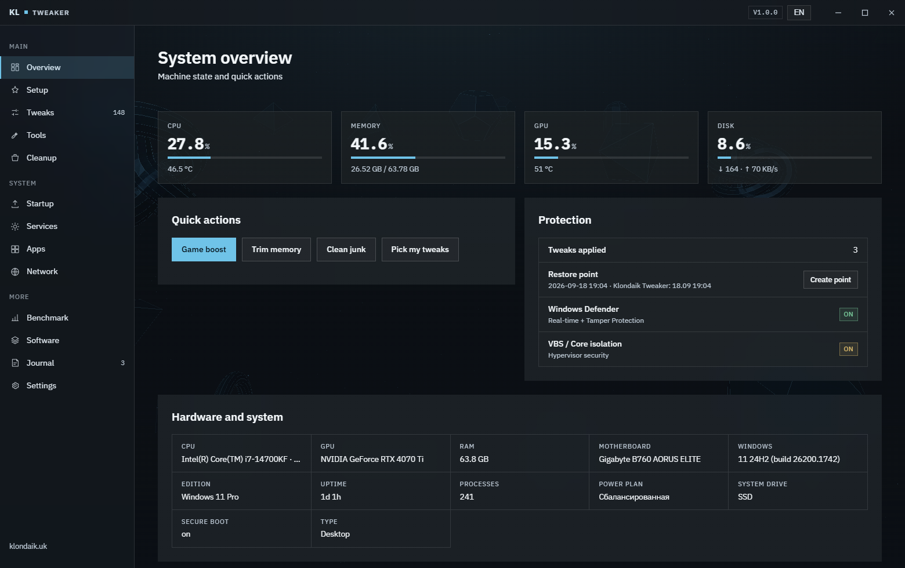
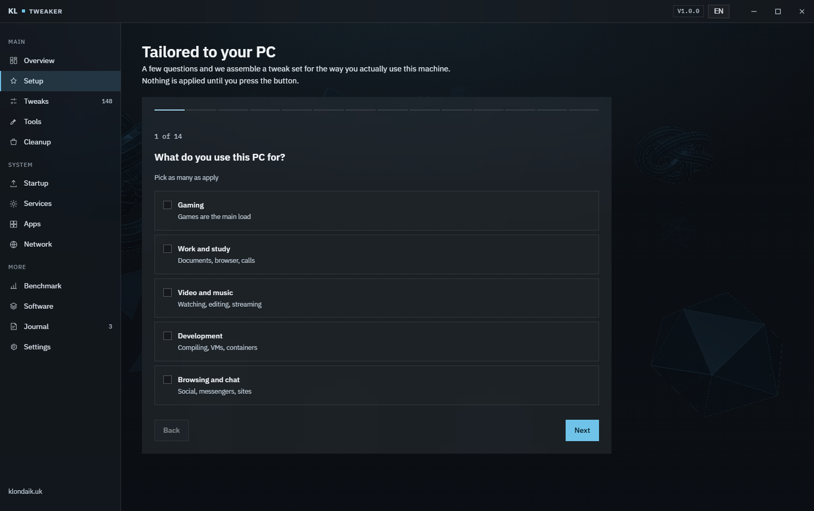
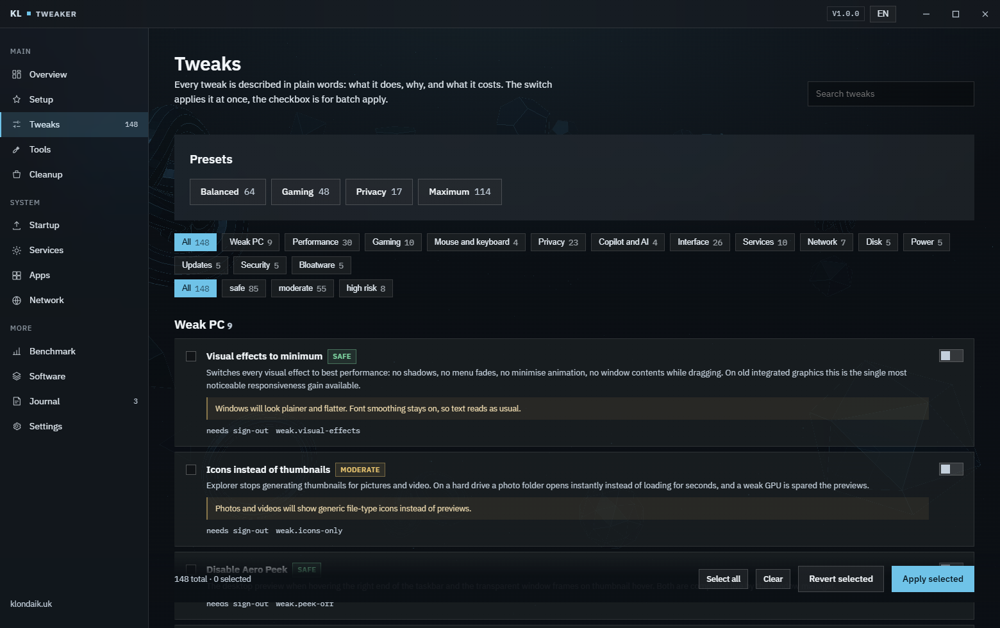
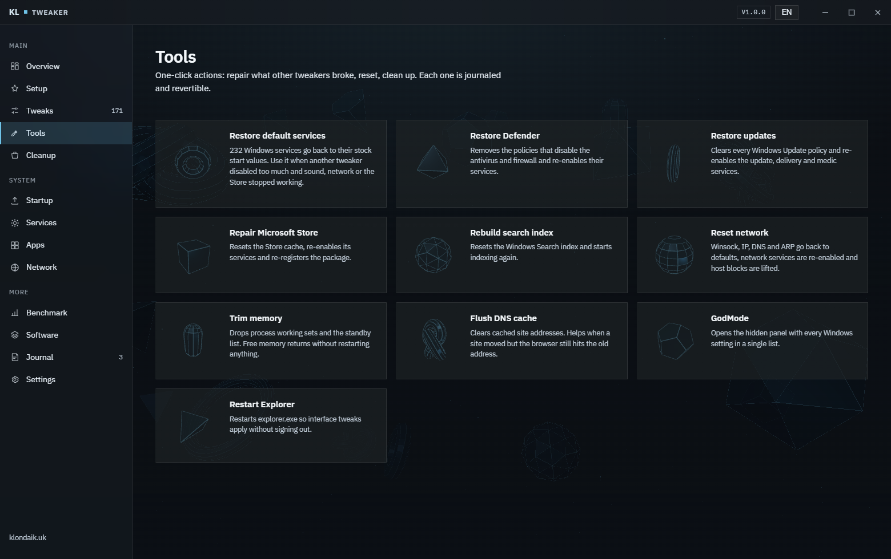

[Русский](README.md) · **English**

# Klondaik Tweaker


A Windows tweaker that remembers what it did. Before every change the previous
value of the key, service or task goes into a journal, and any tweak rolls back
on its own — not by resetting everything, but by undoing exactly the one you
turned on by mistake.

A newcomer does not need to know what `Win32PrioritySeparation` is: they answer
questions about how they use the machine and get a ready set. Everyone else
gets the full catalogue of 171 tweaks, each stating what it costs.



## What it does

- **171 tweaks** across three risk levels, each described in Russian and
  English: what it does, why, and what you pay for it.
- **Question-based setup** — up to 21 questions, the irrelevant ones are
  dropped based on your hardware and answers. Nothing is applied until you press the button.
- **A "Weak PC" category** — things that genuinely speed up old hardware rather
  than placebo: visual effects, thumbnails, memory compression, page file.
- **Per-tweak rollback** — the journal keeps the previous state, and applying a
  tweak twice does not overwrite the original record.
- **TrustedInstaller rights** — keys and services that not even an
  administrator can touch are written under the system service's token.
- **Repair tools** — one-click fixes for what other tweakers broke: services
  back to stock start values, Defender, updates, Store, search, network stack.
- **Interrupts and cores** — pin the interrupts of the GPU, mouse and network
  to chosen CPU threads, with performance and efficiency cores told apart.
- **Network adapter parameters** — everything the driver exposes, with a low
  latency preset.
- **Scheduled tasks** — 12 groups of Windows background tasks, each explaining
  what it does and what turning it off costs.
- **Windows features** — 27 optional components through DISM: what each one is,
  what it is for and which are unsafe to leave on.
- **Cleanup, startup, services, built-in apps, network** — every action is
  journalled too.
- **Benchmark** — CPU, memory, disk and responsiveness, so "before" and "after"
  are numbers rather than impressions.
- **A single portable exe** — 54 MB, no installation, no .NET on the user's
  machine, settings in `%ProgramData%\KlondaikTweaker`.
- **Russian and English** interface, switched without a restart.

## Warning

The program changes the registry, services, scheduled tasks, installed packages
and network settings of Windows. Such changes **can make the system unstable,
disable protection and block updates**.

You use it entirely at your own risk. The copyright holder is not responsible
for breakage, downtime, data loss, disabled protection or any other consequence
— whether you applied a tweak by hand, through the wizard or as a preset. The
journal and the restore point reduce the risk but guarantee nothing: back up
anything you care about.

The full text is in [LICENSE](LICENSE). On first run the program shows the same
warning and will not go further until it is accepted.

## Quick start

### Ready build

Download `KlondaikTweaker.exe` from [releases](../../releases/latest) and run it
as administrator. There is nothing to install, it is one file.

You need Windows 10 1903 or newer, or Windows 11, and the WebView2 Runtime —
already present on Windows 11 and on an up-to-date Windows 10, otherwise the
program offers a link.

### From source

```bash
git clone https://github.com/KrekerDM/klondaik-tweaker.git
```

```powershell
.\build.ps1
```

You need the .NET SDK 10 and Python 3 for the data generators. The script
rebuilds `Assets/Data/*.json`, publishes a self-contained single-file build into
`dist/` and puts a separate package for virtual-machine testing beside it.

The interface without a UAC prompt — the window works, writing to the system
does not:

```powershell
dotnet publish src\KlondaikTweaker -c Release -o out -p:ApplicationManifest=app.dev.manifest
```

```powershell
$env:KLONDAIK_UI_PREVIEW = "1"; .\out\KlondaikTweaker.exe
```

## Setup for your machine

The program works out the hardware class from the amount of memory, the thread
count and the type of the system drive, then asks about how the machine is
used: games, work, an old laptop, whether Defender matters, whether updates
matter. Questions that do not apply are never asked.

The result is a list of checkboxes rather than an "apply everything" button:
each tweak can be unticked after reading what it risks.



## Tweak catalogue

Fourteen categories, three risk levels, search over titles and descriptions, four
ready presets. The switch applies a tweak at once, the checkbox collects it for
a batch. High-risk tweaks stay hidden until enabled in the settings and need a
separate confirmation listing exactly what will be turned off.



## Repair tools

A separate tab for fixing rather than breaking. Another tweaker disabled too
many services and sound, networking or the Store stopped working — "restore
default services" puts 232 services back to their stock start values.



## Updates

Settings → Update → Check for updates. The program asks GitHub for the latest
release and shows the version, the size and the changelog. On "download and
install" the file is fetched with a progress bar, the program closes, the exe is
replaced and started again. Settings, journal and benchmark history stay.

It never downloads or installs on its own: only on a button press. The download
address is verified inside the program rather than trusted from the server's
answer.

## TrustedInstaller rights

Not everything in Windows yields to an administrator: some registry keys,
services and tasks belong to `TrustedInstaller`, and an ordinary write fails
with access denied. Writing goes through three steps, each one used only when
the previous failed:

1. An ordinary write as administrator.
2. Taking ownership of the key for the Administrators group and granting full
   control.
3. Running the operation under the `TrustedInstaller` token, falling back to
   `SYSTEM`.

The token is taken straight from the `TrustedInstaller` service process through
`OpenProcessToken` and `DuplicateTokenEx` — the same trick as `RunAsTI` in
Atlas, but natively in C# with no intermediate scripts. The `SeTakeOwnership`,
`SeRestore`, `SeBackup`, `SeDebug` and `SeImpersonate` privileges are enabled in
the process token at start.

## Rollback and journal

- Before a tweak is applied its previous state is written to
  `%ProgramData%\KlondaikTweaker\journal.json`.
- Applying again does not overwrite the original record, so a rollback always
  returns the first value rather than an intermediate one.
- For moderate and high-risk tweaks a restore point is created before a batch
  apply.
- Rollback is available one by one and all at once on the Journal tab.
- When every target of a tweak (services, tasks) is missing from this system it
  is marked unavailable rather than "not applied", so the switch does not look
  broken.

## How it is built

```
src/KlondaikTweaker/
  MainForm.cs          frameless WinForms window, WebView2, assets served from resources
  Program.cs           rights request, self-test modes from the command line
  Host/Api.cs          one method → object router, postMessage JSON bridge
  Host/SelfTest.cs     backend checks and the end-to-end apply/revert test
  Host/ModuleTest.cs   a real run of every module, report flushed after each step
  Core/Engine/         detection, apply, revert, journal, hardware facts
  Core/Modules/        cleanup, services, startup, apps, network, benchmark,
                       game boost, software catalogue, repair, updates
  Core/Win/            registry with escalation, TrustedInstaller token, privileges
  Assets/Data/         tweaks, wizard, software catalogue, service defaults — in the exe
  Assets/wwwroot/      HTML, CSS and ES modules with no bundler, three.js backdrop
tools/                 Python data generators and the test-machine package
docs/                  screenshots, the script that rebuilds them, release notes
build.ps1              data generation and exe publishing
```

**Interface.** Files are served straight from assembly resources at
`https://app.klondaik/`, and navigation outside that address is blocked. No npm
and no bundler: plain ES modules.

**3D.** The backdrop is eighteen three.js primitives. The cards on the Tools tab
are drawn by a single WebGL context through scissor and viewport rather than
twenty contexts, so the tab does not bring the GPU down.

**Data.** Tweaks are written in Python rather than JSON by hand: the generator
checks identifier uniqueness, registry hives, value types and non-empty
descriptions in both languages, and exits non-zero on an error.

## Adding a tweak

Tweaks live in `tools/tweaks_a.py` … `tweaks_e.py`:

```python
T("perf.example", "performance", "advanced",
  ("Заголовок", "Что это и зачем", "Чем рискуете"),
  ("Title", "What and why", "What it costs"),
  [R("HKLM", CCS + r"\Control\Example", "Value", "dword", 1, 0)],
  tags=["fps"], src="atlas", restart=True)
```

```powershell
python tools\gen_tweaks.py
```

Action kinds: `R` registry, `RD` delete value, `SV` service, `TK` scheduled
task, `AX` app package, `CM` command, `PS` PowerShell, `HS` hosts entries. The
`req` field limits a tweak to a system: `win11`, `ssd`, `laptop`, `desktop`,
`nvidia`, `b24h2`, `lowram`, `highram`, `weakcpu`, `weak`, `strong`.

The table of stock start values for 232 services is in
`tools/service_defaults.txt` and is built by `python tools\gen_repair.py`.

## Tests

Backend self-check, read-only, no administrator rights needed:

```powershell
.\dist\KlondaikTweaker.exe --selftest report.txt
```

A check of the rollback machinery on a throwaway registry key, touching nothing
of the system:

```powershell
.\dist\KlondaikTweaker.exe --selftest-apply report.txt --canary-only
```

A run over the **whole catalogue**: every tweak is applied, detection is
verified, then it is reverted and the state compared byte for byte with the
original. **Virtual machines only.**

```powershell
.\dist\KlondaikTweaker.exe --selftest-apply report.txt --all
```

A module run: really performs cleanup, the benchmark, game boost, every button
on the Tools tab, a restore point and a network reset. The report is flushed
after each step, so an interruption halfway does not lose the result.
**Virtual machines only.**

```powershell
.\dist\KlondaikTweaker.exe --selftest-modules report.txt
```

On Windows 10 21H1 in a virtual machine: 149 of 149 tweaks applied and reverted
with the state matching byte for byte, 26 of 26 backend checks, 23 of 23
modules. Compared against the reference tweakers: 99 registry values match,
13 differ deliberately.

The screenshots in this README are rebuilt from the same `wwwroot` that ships
inside the exe:

```powershell
python docs\make_screenshots.py
```

## Limitations

- **Built-in app removal and winget installs are not verified**: the test
  machine had no removable packages left and that image has no winget.
- Defender tweaks will not apply while Tamper Protection is on — the program
  says so.
- `System.Management` (WMI) does not work in .NET 10 single-file builds, so
  hardware facts come from the registry, WinAPI and targeted PowerShell calls.
  Do not bring that package back into the project.
- `CetCompat` is off in the csproj on purpose: with it .NET 10 marks the exe as
  Intel CET compatible, and on Windows 10 builds without full CET support the
  process dies before `Main` with `0x80131506`.
- Boot time is read from the event log and needs administrator rights, and CPU
  temperature comes from ACPI and is not available on every motherboard.
- The build is not signed, so SmartScreen warns about an unknown publisher on
  first run.

## Sources

Registry paths and parameter values are facts about how Windows works, not
somebody else's code. The engine, the descriptions and the interface are written
from scratch. The projects whose ideas, data and techniques were used are listed
inside the program on the Settings tab:
[Atlas OS](https://github.com/Atlas-OS/Atlas) (GPL v3, he3als and Xyueta),
All Tweaker (MIT, Nikita Solomon),
[LeanAndMean](https://github.com/AveYo/LeanAndMean) (MIT, AveYo),
[TimerResolution](https://github.com/amitxv/TimerResolution) (amitxv),
ios1ph optimization, Frostpane (MIT, krekerdm),
[three.js](https://github.com/mrdoob/three.js) (MIT),
[IBM Plex](https://github.com/IBM/plex) (SIL OFL 1.1).

## License

MIT — see [LICENSE](LICENSE), including a separate disclaimer for the
consequences of changing the system.

The look follows the Frostpane design system. Fonts are IBM Plex (SIL OFL 1.1),
three.js (MIT).
