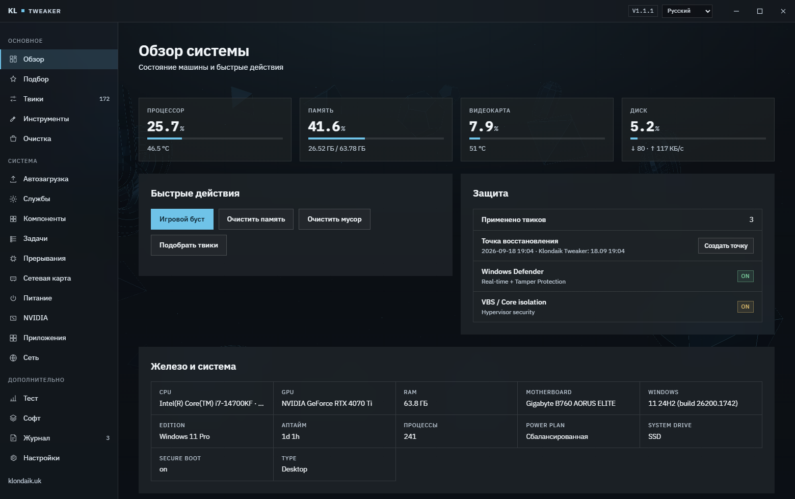
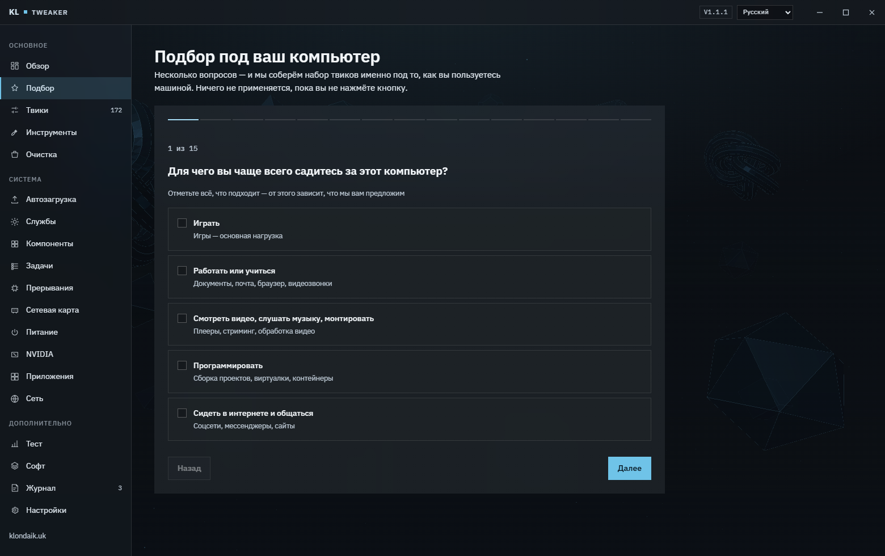
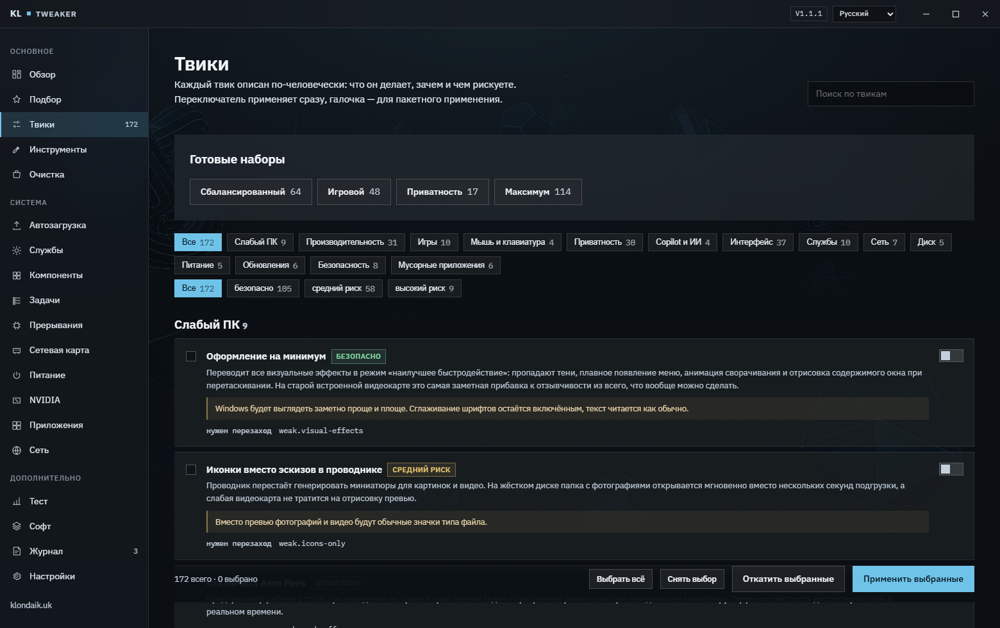
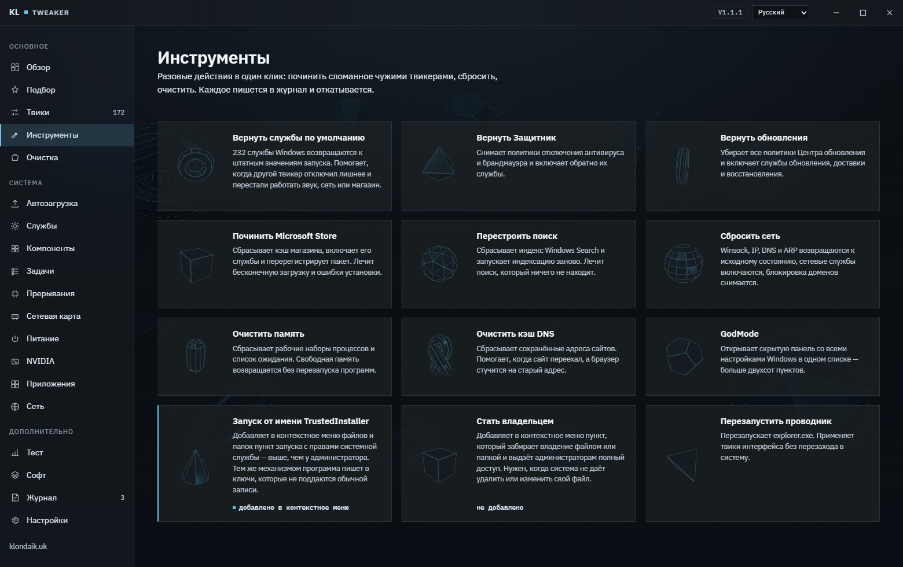
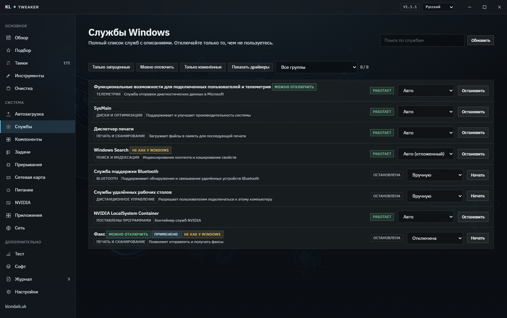
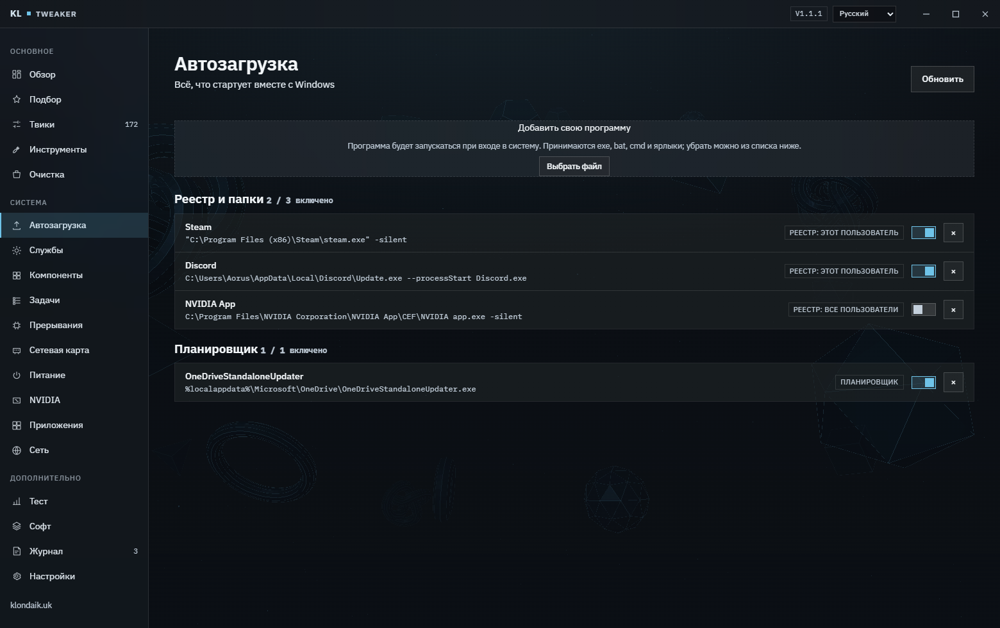

**Русский** · [English](README.en.md)

# Klondaik Tweaker


Твикер Windows, который помнит, что он сделал. Перед каждым изменением прежнее
значение ключа, службы или задачи уходит в журнал, и любой твик откатывается
по отдельности — не «сбросом всего», а именно тем, что вы включили зря.

Новичку не нужно знать, что такое `Win32PrioritySeparation`: он отвечает на
вопросы о том, как пользуется машиной, и получает готовый набор. Опытному
доступен весь каталог из 172 твиков с описанием, чем именно каждый рискует.



## Что умеет

- **172 твика** в трёх уровнях риска, каждый с описанием на русском и
  английском: что делает, зачем и чем вы за это платите.
- **Подбор по вопросам** — до 21 вопроса, лишние отсеиваются по железу и ответам.
  Ничего не применяется, пока вы не нажмёте кнопку.
- **Категория «Слабый ПК»** — то, что реально ускоряет старое железо, а не
  добавляет плацебо: визуальные эффекты, эскизы, сжатие памяти, файл подкачки.
- **Откат каждого твика** — журнал хранит прежнее состояние, повторное
  применение не затирает исходную запись.
- **Права TrustedInstaller** — ключи и службы, которые не поддаются даже
  администратору, берутся токеном системной службы.
- **Инструменты** — разовая починка того, что сломали другие твикеры: службы к
  штатным значениям, Защитник, обновления, Store, поиск, сетевой стек.
- **Прерывания и ядра** — привязка прерываний видеокарты, мыши и сети к
  выбранным потокам процессора, с делением на P- и E-ядра.
- **Параметры сетевой карты** — всё, что разрешает драйвер, с пресетом на
  низкую задержку.
- **Задачи планировщика** — 12 групп фоновых задач Windows с объяснением, что
  делает каждая и что будет, если её выключить.
- **Компоненты Windows** — 27 необязательных компонентов через DISM: что это,
  зачем и что из них опасно держать включённым.
- **Службы по группам** — 24 группы по смыслу (печать, Bluetooth, VPN,
  Hyper-V, индексация и так далее), отдельная группа для служб, которые
  поставила не Windows, а ваши программы. Драйверы устройств помечены и убраны
  с глаз, пока сами не попросите.
- **Схемы электропитания** — переключение, экспорт, импорт и показ скрытых
  настроек, которые Windows прячет из панели управления.
- **Устройства-призраки** — записи о железе, которого в компьютере больше нет.
  Диски, тома и системные классы не трогаются.
- **Панель NVIDIA** — профили драйвера через вложенный Profile Inspector,
  с экспортом и импортом настроек.
- **Очистка, автозагрузка, службы, встроенные приложения, сеть** — каждое
  действие тоже пишется в журнал. В автозагрузку можно добавить свою программу
  кнопкой выбора файла, в очистке есть отдельная строка для папок приложений,
  которые вы давно удалили.
- **Бенчмарк** — процессор, память, диск и отзывчивость, чтобы сравнить «до» и
  «после» цифрами, а не ощущениями.
- **Один переносимый exe** — 54 МБ, без установки, без .NET на машине
  пользователя, настройки в `%ProgramData%\KlondaikTweaker`.
- **Одиннадцать языков** интерфейса: русский, украинский, белорусский, казахский,
  узбекский, азербайджанский, английский, немецкий, польский, испанский и
  французский. Описания твиков пока на русском и английском.

## Предупреждение

Программа меняет реестр, службы, задания планировщика, установленные пакеты и
сетевые настройки Windows. Такие изменения **могут сделать систему
нестабильной, отключить защиту и помешать установке обновлений**.

Вы используете её на свой страх и риск. Правообладатель не несёт
ответственности за поломки, простой, потерю данных, отключённую защиту и любые
другие последствия — независимо от того, применили вы твик руками, через
мастер подбора или пресетом. Журнал и точка восстановления снижают риск, но
ничего не гарантируют: сделайте резервную копию того, что вам дорого.

Полный текст — в [LICENSE](LICENSE). При первом запуске программа покажет это
же предупреждение, и без согласия дальше не пустит.

## Быстрый старт

### Готовая сборка

Скачайте `KlondaikTweaker.exe` из [релизов](../../releases/latest) и запустите
от имени администратора. Устанавливать нечего, файл один.

Нужна Windows 10 1903 или новее либо Windows 11 и WebView2 Runtime — он уже
стоит на Windows 11 и на актуальной Windows 10, иначе программа даст ссылку.

### Из исходников

```bash
git clone https://github.com/KrekerDM/klondaik-tweaker.git
```

```powershell
.\build.ps1
```

Нужны .NET SDK 10 и Python 3 для генераторов данных. Скрипт пересобирает
`Assets/Data/*.json`, публикует self-contained single-file сборку в `dist/` и
складывает отдельный пакет для тестов в виртуальной машине.

Интерфейс без запроса UAC — окно работает, запись в систему нет:

```powershell
dotnet publish src\KlondaikTweaker -c Release -o out -p:ApplicationManifest=app.dev.manifest
```

```powershell
$env:KLONDAIK_UI_PREVIEW = "1"; .\out\KlondaikTweaker.exe
```

## Подбор под машину

Программа сама определяет класс железа по объёму памяти, числу потоков и типу
системного диска, и дальше спрашивает про сценарии: игры, работа, старый ноутбук,
нужен ли Защитник, важны ли обновления. Вопросы, которые к этой машине не
относятся, не задаются.

Результат — список с галочками, а не «применить всё»: каждый твик можно снять,
прочитав, чем он рискует.



## Каталог твиков

Четырнадцать категорий, три уровня риска, поиск по названию и описанию, четыре
готовых набора. Переключатель применяет твик сразу, галочка копит его для
пакетного применения. Твики высокого риска скрыты, пока их не включить в
настройках, и требуют отдельного подтверждения со списком того, что именно
будет отключено.



## Инструменты

Отдельная вкладка для того, чтобы чинить, а не ломать. Другой твикер отключил
лишние службы и перестал работать звук, сеть или магазин — «Вернуть службы по
умолчанию» возвращает 232 службы к штатным значениям запуска.



## Службы

Полный список с описаниями, разложенный по 24 группам: печать, Bluetooth, VPN,
дистанционное управление, Hyper-V, индексация и так далее. Отдельная группа
показывает службы, которые поставила не Windows, а ваши программы — это видно
по тому, откуда запускается файл. Драйверы устройств помечены и по умолчанию
скрыты: на обычной машине их 445 из 759, и они только мешают читать список.
Фильтр «только изменённые» показывает то, что отличается от штатного значения.



## Автозагрузка

Реестр, папки автозагрузки и задачи планировщика в одном списке, с указанием,
откуда именно берётся запись. Свою программу можно добавить кнопкой выбора
файла: exe и bat ложатся значением в реестр, ярлык копируется в папку
автозагрузки.



## Обновление

«Настройки» → «Обновление» → «Проверить обновления». Программа спрашивает у
GitHub последний релиз, показывает номер версии, размер и список изменений. По
кнопке «Скачать и установить» файл скачивается с прогрессом, программа
закрывается, exe заменяется и запускается заново. Настройки, журнал и история
бенчмарка остаются на месте.

Само ничего не качает и не ставит: только по кнопке. Адрес скачивания
проверяется на стороне программы, а не берётся на веру из ответа сервера.

## Права TrustedInstaller

Не всё в Windows поддаётся администратору: часть ключей реестра, служб и задач
принадлежит `TrustedInstaller`, и обычная запись в них падает с отказом в
доступе. Запись идёт по трём ступеням, каждая следующая включается только если
предыдущая не сработала:

1. Обычная запись от администратора.
2. Смена владельца ключа на группу администраторов и выдача полного доступа.
3. Выполнение операции под токеном `TrustedInstaller`, с откатом на `SYSTEM`.

Токен берётся напрямую из процесса службы `TrustedInstaller` через
`OpenProcessToken` и `DuplicateTokenEx` — тот же приём, что в `RunAsTI` у Atlas,
но нативно на C#, без промежуточных скриптов. Привилегии `SeTakeOwnership`,
`SeRestore`, `SeBackup`, `SeDebug` и `SeImpersonate` включаются в токене
процесса при старте.

## Откат и журнал

- Перед применением твика прежнее состояние пишется в
  `%ProgramData%\KlondaikTweaker\journal.json`.
- Повторное применение не затирает исходную запись, поэтому откат всегда
  возвращает первоначальное значение, а не промежуточное.
- Для твиков среднего и высокого риска перед пакетным применением создаётся
  точка восстановления.
- Откат доступен поштучно и целиком на вкладке «Журнал».
- Если все цели твика (службы, задачи) на этой системе отсутствуют, он
  помечается недоступным, а не «не применён» — переключатель не выглядит
  сломанным.

## Как это устроено

```
src/KlondaikTweaker/
  MainForm.cs          безрамочное окно WinForms, WebView2, отдача ресурсов из сборки
  Program.cs           запрос прав, режимы самопроверки из командной строки
  Host/Api.cs          один роутер method → object, обмен через postMessage JSON
  Host/SelfTest.cs     проверки бэкенда и сквозной тест применения с откатом
  Host/ModuleTest.cs   реальный прогон всех модулей с отчётом после каждого шага
  Core/Engine/         определение состояния, применение, откат, журнал, железо
  Core/Modules/        очистка, службы, автозагрузка, приложения, сеть, бенчмарк,
                       игровой буст, каталог софта, починка, обновление
  Core/Win/            реестр с эскалацией прав, токен TrustedInstaller, привилегии
  Assets/Data/         твики, мастер, каталог софта, дефолты служб — вшиты в exe
  Assets/wwwroot/      HTML, CSS и ES-модули без сборщика, three.js для фона
tools/                 генераторы данных на Python и пакет для тестовой машины
docs/                  скриншоты, скрипт их пересборки, заготовка релиза
build.ps1              генерация данных и публикация exe
```

**Интерфейс.** Файлы отдаются прямо из ресурсов сборки по адресу
`https://app.klondaik/`, навигация за пределы этого адреса запрещена. Ни npm,
ни сборщика: обычные ES-модули.

**3D.** Фон — восемнадцать примитивов three.js. Карточки «Инструментов» рисует
один и тот же WebGL-контекст через scissor и viewport, а не двадцать
контекстов, поэтому вкладка не роняет видеокарту.

**Данные.** Твики описываются в Python, а не в JSON руками: генератор проверяет
уникальность идентификаторов, корректность веток реестра, типов значений и
непустые описания на обоих языках, и падает с ненулевым кодом на ошибке.

## Как добавить твик

Твики лежат в `tools/tweaks_a.py` … `tweaks_e.py`:

```python
T("perf.example", "performance", "advanced",
  ("Заголовок", "Что это и зачем", "Чем рискуете"),
  ("Title", "What and why", "What it costs"),
  [R("HKLM", CCS + r"\Control\Example", "Value", "dword", 1, 0)],
  tags=["fps"], src="atlas", restart=True)
```

```powershell
python tools\gen_tweaks.py
```

Виды действий: `R` реестр, `RD` удаление значения, `SV` служба, `TK` задача
планировщика, `AX` пакет приложения, `CM` команда, `PS` PowerShell, `HS` домены
в hosts. Поле `req` ограничивает твик системой: `win11`, `ssd`, `laptop`,
`desktop`, `nvidia`, `b24h2`, `lowram`, `highram`, `weakcpu`, `weak`, `strong`.

Таблица штатных значений запуска для 232 служб лежит в
`tools/service_defaults.txt` и собирается через `python tools\gen_repair.py`.

## Тесты

Самопроверка бэкенда, только чтение, прав администратора не требует:

```powershell
.\dist\KlondaikTweaker.exe --selftest report.txt
```

Проверка механизма отката на выброшенном ключе реестра, ничего системного не
трогает:

```powershell
.\dist\KlondaikTweaker.exe --selftest-apply report.txt --canary-only
```

Прогон **всего каталога**: каждый твик применяется, проверяется определение
состояния, откатывается и сверяется побайтово с исходным. **Только в
виртуалке.**

```powershell
.\dist\KlondaikTweaker.exe --selftest-apply report.txt --all
```

Прогон модулей: по-настоящему выполняет очистку, бенчмарк, игровой буст, все
кнопки «Инструментов», точку восстановления и сброс сети. Отчёт пишется после
каждого шага, поэтому обрыв посередине не теряет результат. **Только в
виртуалке.**

```powershell
.\dist\KlondaikTweaker.exe --selftest-modules report.txt
```

Замер скорости интерфейса, только чтение: каждый вызов делается дважды,
холодный и повторный.

```powershell
.\dist\KlondaikTweaker.exe --perf report.txt
```

На Windows 10 22H2 в виртуальной машине: **172 из 173** твиков применились и
откатились с побайтовым совпадением состояния, **26 из 26** проверок бэкенда,
**38 из 38** модулей. Единственный не прошедший твик — отключение
зарезервированного хранилища: Windows на той машине отказывает сама
(`0x800f0975`, идёт обслуживание образа), и этот ответ виден в отчёте. Сверка с
эталонными твикерами: 99 значений реестра совпадают, 13 расходятся осознанно.

Скриншоты в этом README пересобираются из того же `wwwroot`, что идёт в exe:

```powershell
python docs\make_screenshots.py
```

## Что дальше

Разбор чужого твикера и сверка с нашим каталогом лежат в
[docs/backlog.md](docs/backlog.md): чего у нас нет, что сделано грубее и в
каком порядке это стоит брать.

## Ограничения

- **Удаление встроенных приложений и установка софта через winget не
  проверены**: в тестовой машине не осталось удаляемых пакетов, а winget в том
  образе отсутствует.
- Твики Защитника не применятся при включённой защите от подделки — программа
  предупреждает об этом.
- `System.Management` (WMI) не работает в single-file сборках .NET 10, поэтому
  сведения о железе собираются из реестра, WinAPI и точечных вызовов
  PowerShell. Не возвращайте этот пакет в проект.
- `CetCompat` в csproj выключен намеренно: с ним .NET 10 помечает exe как
  совместимый с Intel CET, и на сборках Windows 10 без полной поддержки CET
  процесс падает до входа в `Main` с `0x80131506`.
- Время загрузки системы читается из журнала событий и требует прав
  администратора, температура процессора берётся из ACPI и доступна не на всех
  материнских платах.
- Сборка не подписана сертификатом, поэтому SmartScreen при первом запуске
  предупредит о неизвестном издателе.

## Источники

Пути в реестре и значения параметров — это факты об устройстве Windows, а не
чужой код. Движок, описания и интерфейс написаны с нуля. Проекты, из которых
взяты идеи, данные и приёмы, перечислены в самой программе на вкладке
«Настройки»: [Atlas OS](https://github.com/Atlas-OS/Atlas) (GPL v3, he3als и
Xyueta), All Tweaker (MIT, Nikita Solomon),
[LeanAndMean](https://github.com/AveYo/LeanAndMean) (MIT, AveYo),
[TimerResolution](https://github.com/amitxv/TimerResolution) (amitxv),
ios1ph optimization, Frostpane (MIT, krekerdm),
[three.js](https://github.com/mrdoob/three.js) (MIT),
[IBM Plex](https://github.com/IBM/plex) (SIL OFL 1.1).

## Лицензия

MIT — см. [LICENSE](LICENSE), включая отдельный отказ от ответственности за
последствия изменения системы.

Внешний вид следует дизайн-системе Frostpane. Шрифты IBM Plex (SIL OFL 1.1),
three.js (MIT).
